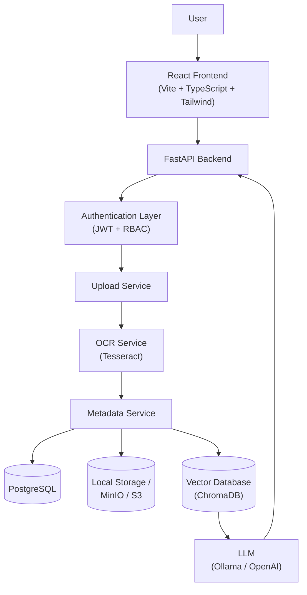
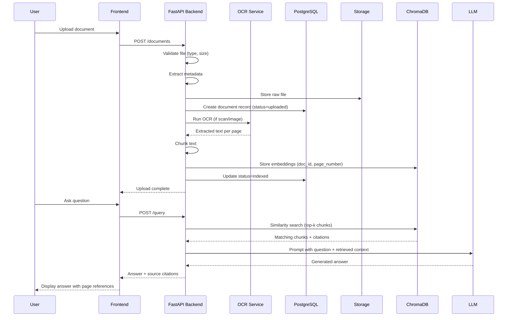
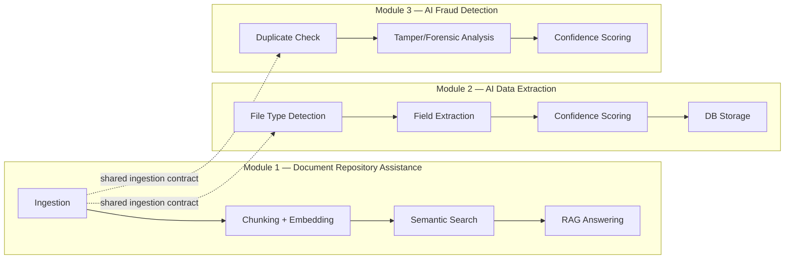

# DocSentinel — System Architecture

## System Overview

DocSentinel is a three-module, AI-powered Document Management System built around a **Retrieval-Augmented Generation (RAG) core**, an **AI extraction pipeline**, and a **fraud-detection engine**. The system is layered so that each concern — presentation, orchestration, AI processing, and persistence — can scale, fail, and be replaced independently.

### Layer responsibilities

| Layer | Responsibility | Key tech |
|---|---|---|
| Presentation | Renders UI, manages client state, calls backend REST API | React, Vite, TypeScript, Tailwind |
| API / Orchestration | Routes requests, enforces auth, coordinates services | FastAPI |
| Authentication | Issues/validates JWTs, enforces role-based access | JWT, Passlib |
| Upload Service | Receives files, validates type/size, hands off to storage + OCR | FastAPI route + service class |
| OCR Service | Converts scanned/image documents into machine-readable text | Tesseract |
| Metadata Service | Normalizes parsed output into the ingestion contract shape, writes DB rows | Python service layer |
| Relational Store | Source of truth for users, roles, documents, metadata, logs | PostgreSQL |
| Object Store | Stores raw uploaded files | Local disk (dev) → MinIO/S3 (prod) |
| Vector Store | Stores chunk embeddings for semantic search | ChromaDB |
| LLM Layer | Generates grounded answers from retrieved chunks | Ollama (dev), OpenAI (optional prod) |

### Why this architecture scales

- **Stateless API layer** — FastAPI instances hold no session state, so horizontal scaling is just adding more containers behind a load balancer.
- **Separation of relational vs vector storage** — exact structured lookups (permissions, status) stay in Postgres; "find semantically similar" queries stay in Chroma. Neither system is forced to do the other's job.
- **Swappable object storage** — the storage service is coded behind an interface, so moving from local disk to MinIO/S3 requires no changes to upload or OCR logic.
- **Swappable LLM/embedding backends** — Ollama for free local development, OpenAI as a drop-in production upgrade, without touching RAG orchestration code.
- **Decoupled OCR** — OCR is CPU-heavy and can be moved to a background worker/queue (e.g. Celery + Redis) later without changing the API contract.

## Request Lifecycle: Upload → Answer

### Why RAG instead of a plain LLM call

A raw LLM call has no knowledge of an organization's private documents and can hallucinate facts. RAG grounds every answer in retrieved chunks from the vector database, and because each chunk carries its `document_id` + `page_number`, the answer can cite exactly where it came from — this is what makes Module 1 auditable rather than a black box.

## Module Boundaries

All three modules consume the same normalized ingestion output (see `ingestion-contract.md`), so adding Module 3 later required no changes to how Module 1 or 2 ingest files.
