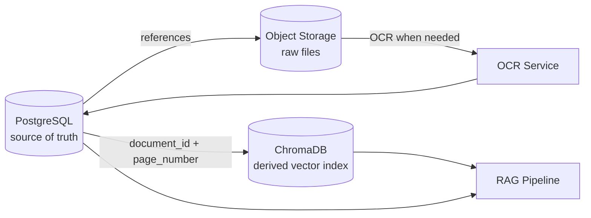
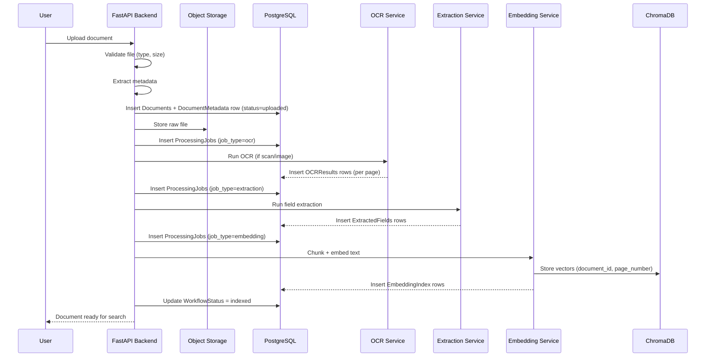

# DocSentinel — Database Schema Design

*A production-grade relational schema for a multi-module AI Document Management System.*

---

## 1. Database Overview

### Why PostgreSQL

DocSentinel' core data — who owns a document, what folder it's in, what role a user has, what happened to a file over time — is inherently structured and relational. PostgreSQL gives us:

- **ACID transactions**, so a document upload (file write + DB row + audit log) either fully succeeds or fully rolls back.
- **JSONB columns** for the genuinely flexible parts (arbitrary extracted fields, OCR metadata) without abandoning a relational core for everything else.
- **Mature RBAC-friendly features** (row-level security, roles) that map directly onto our permission model.

### Why ChromaDB Is Separate

PostgreSQL is built for exact, structured lookups ("which documents can user X see"). ChromaDB is built for approximate nearest-neighbor search over high-dimensional embedding vectors ("which text chunks are semantically closest to this question"). These are different computational problems with different indexing strategies (B-tree/GIN vs. HNSW/vector indexes). Running both in one engine would compromise one workload to accommodate the other. Postgres remains the **source of truth**; ChromaDB is a **derived, rebuildable index** — if it's ever wiped, it can be regenerated from Postgres + stored files.

### Why Files Are Not Stored in PostgreSQL

Storing binary file content as `BYTEA`/`LOB` in Postgres bloats the database, slows backups, and doesn't scale past a certain volume. Instead, Postgres stores a `storage_path` (a reference), and the actual bytes live in the object store (local disk in dev, MinIO/S3 in prod). This keeps the database small, fast, and easy to back up, while storage scales independently.

### How the Pieces Relate

Postgres is the hub: it knows what exists, who can see it, and where the bytes and vectors live. Object storage and ChromaDB never talk to each other directly — they're both downstream of Postgres-tracked state.

---

## 2. Entity Relationship Diagram

```mermaid
erDiagram
    USERS ||--o{ USER_ROLES : has
    ROLES ||--o{ USER_ROLES : assigned_to
    USERS ||--o{ DOCUMENTS : uploads
    FOLDERS ||--o{ DOCUMENTS : contains
    FOLDERS ||--o{ FOLDERS : parent_of
    DOCUMENTS ||--o{ DOCUMENT_VERSIONS : has
    DOCUMENTS ||--|| DOCUMENT_METADATA : has
    DOCUMENTS ||--o{ DOCUMENT_TAGS : tagged_with
    TAGS ||--o{ DOCUMENT_TAGS : applied_to
    DOCUMENTS ||--o{ OCR_RESULTS : produces
    DOCUMENTS ||--o{ EXTRACTED_FIELDS : yields
    DOCUMENTS ||--o{ EMBEDDING_INDEX : indexed_as
    DOCUMENTS ||--o{ FRAUD_DETECTION_RESULTS : screened_for
    DOCUMENTS ||--o{ PROCESSING_JOBS : tracked_by
    DOCUMENTS ||--o{ AUDIT_LOGS : logged_in
    DOCUMENTS }o--|| WORKFLOW_STATUS : currently_in
    ROLES ||--o{ PERMISSIONS : grants
    FOLDERS ||--o{ PERMISSIONS : scoped_to

    USERS {
        uuid id PK
        string email
        string password_hash
        string full_name
        boolean is_active
        timestamp created_at
    }
    ROLES {
        uuid id PK
        string name
        string description
    }
    USER_ROLES {
        uuid id PK
        uuid user_id FK
        uuid role_id FK
    }
    PERMISSIONS {
        uuid id PK
        uuid role_id FK
        uuid folder_id FK
        string access_level
    }
    FOLDERS {
        uuid id PK
        string name
        uuid parent_folder_id FK
        string record_class
    }
    DOCUMENTS {
        uuid id PK
        string filename
        string original_filename
        string file_type
        string mime_type
        string storage_path
        string checksum
        uuid uploaded_by FK
        uuid folder_id FK
        uuid current_version_id FK
        uuid workflow_status_id FK
        boolean is_deleted
        timestamp created_at
        timestamp updated_at
    }
    DOCUMENT_VERSIONS {
        uuid id PK
        uuid document_id FK
        int version_number
        string storage_path
        string checksum
        uuid created_by FK
        timestamp created_at
    }
    DOCUMENT_METADATA {
        uuid id PK
        uuid document_id FK
        bigint size_bytes
        int page_count
        boolean ocr_applied
        jsonb custom_fields
    }
    TAGS {
        uuid id PK
        string name
    }
    DOCUMENT_TAGS {
        uuid id PK
        uuid document_id FK
        uuid tag_id FK
    }
    OCR_RESULTS {
        uuid id PK
        uuid document_id FK
        int page_number
        text extracted_text
        float confidence_score
        timestamp processed_at
    }
    EXTRACTED_FIELDS {
        uuid id PK
        uuid document_id FK
        string field_name
        string field_value
        float confidence_score
        boolean human_verified
    }
    EMBEDDING_INDEX {
        uuid id PK
        uuid document_id FK
        int page_number
        int chunk_index
        string vector_db_ref
        timestamp indexed_at
    }
    FRAUD_DETECTION_RESULTS {
        uuid id PK
        uuid document_id FK
        boolean is_duplicate
        boolean tamper_suspected
        float risk_score
        jsonb details
        timestamp checked_at
    }
    WORKFLOW_STATUS {
        uuid id PK
        string name
        string description
    }
    PROCESSING_JOBS {
        uuid id PK
        uuid document_id FK
        string job_type
        string status
        text error_message
        timestamp started_at
        timestamp completed_at
    }
    AUDIT_LOGS {
        uuid id PK
        uuid document_id FK
        uuid user_id FK
        string action
        jsonb details
        timestamp logged_at
    }
```

**Relationship notes:**
- `USERS` ↔ `ROLES` is N:M, resolved via `USER_ROLES`.
- `FOLDERS` is self-referential (`parent_folder_id`) to support nested folder hierarchies.
- `DOCUMENTS` ↔ `DOCUMENT_METADATA` is 1:1 (metadata split out to keep the core `documents` row lean).
- `DOCUMENTS` ↔ `TAGS` is N:M via `DOCUMENT_TAGS`.
- `DOCUMENTS` → `WORKFLOW_STATUS` is optional-to-one (a document may not yet be in any workflow).
- `DOCUMENTS` ↔ `DOCUMENT_VERSIONS`, `OCR_RESULTS`, `EXTRACTED_FIELDS`, `EMBEDDING_INDEX`, `FRAUD_DETECTION_RESULTS`, `PROCESSING_JOBS`, `AUDIT_LOGS` are all 1:N (a document accumulates many of each over its lifecycle).

---

## 3. Table Definitions

### Users
**Purpose:** Stores authenticated accounts.

| Column | Type | Notes |
|---|---|---|
| id | UUID (PK) | Primary key |
| email | VARCHAR, UNIQUE | Login identifier |
| password_hash | VARCHAR | Bcrypt/Argon2 hash, never plaintext |
| full_name | VARCHAR | Display name |
| is_active | BOOLEAN | Soft-disable without deleting the account |
| created_at | TIMESTAMPTZ | Audit trail |

### Roles
**Purpose:** Defines the set of roles in the system (e.g. Admin, Reviewer, Uploader, Auditor).

| Column | Type | Notes |
|---|---|---|
| id | UUID (PK) | |
| name | VARCHAR, UNIQUE | e.g. `admin`, `uploader` |
| description | TEXT | Human-readable purpose of the role |

### UserRoles
**Purpose:** N:M join table — a user can hold multiple roles.

| Column | Type | Notes |
|---|---|---|
| id | UUID (PK) | |
| user_id | UUID (FK → Users) | |
| role_id | UUID (FK → Roles) | |

### Permissions
**Purpose:** Scopes a role's access to a specific folder/record class — this is what makes RBAC folder-aware rather than global.

| Column | Type | Notes |
|---|---|---|
| id | UUID (PK) | |
| role_id | UUID (FK → Roles) | |
| folder_id | UUID (FK → Folders) | |
| access_level | VARCHAR | `read`, `write`, `admin` |

### Folders
**Purpose:** Organizational hierarchy and record-class boundary; self-referential for nesting.

| Column | Type | Notes |
|---|---|---|
| id | UUID (PK) | |
| name | VARCHAR | |
| parent_folder_id | UUID (FK → Folders, nullable) | NULL = root folder |
| record_class | VARCHAR | e.g. `invoices`, `contracts` — used for RBAC filtering |

### Documents
**Purpose:** Core record for every uploaded file.

| Column | Type | Notes |
|---|---|---|
| id | UUID (PK) | |
| filename | VARCHAR | Stored filename (may be sanitized/renamed) |
| original_filename | VARCHAR | As uploaded by the user |
| file_type | VARCHAR | `pdf`, `docx`, `image`, etc. |
| mime_type | VARCHAR | e.g. `application/pdf` |
| storage_path | VARCHAR | Reference into object storage, not the file itself |
| checksum | VARCHAR | SHA-256 hash — integrity verification and duplicate detection |
| uploaded_by | UUID (FK → Users) | |
| folder_id | UUID (FK → Folders) | |
| current_version_id | UUID (FK → DocumentVersions, nullable) | Points at the active version |
| workflow_status_id | UUID (FK → WorkflowStatus, nullable) | |
| is_deleted | BOOLEAN | Soft delete flag |
| created_at / updated_at | TIMESTAMPTZ | |

### DocumentVersions
**Purpose:** Immutable history every time a document is replaced/re-uploaded.

| Column | Type | Notes |
|---|---|---|
| id | UUID (PK) | |
| document_id | UUID (FK → Documents) | |
| version_number | INT | Monotonically increasing per document |
| storage_path | VARCHAR | Each version has its own file reference |
| checksum | VARCHAR | |
| created_by | UUID (FK → Users) | |
| created_at | TIMESTAMPTZ | |

### DocumentMetadata
**Purpose:** Flexible/derived attributes split out of the core `Documents` row.

| Column | Type | Notes |
|---|---|---|
| id | UUID (PK) | |
| document_id | UUID (FK → Documents), UNIQUE | 1:1 with Documents |
| size_bytes | BIGINT | |
| page_count | INT | |
| ocr_applied | BOOLEAN | |
| custom_fields | JSONB | Escape hatch for attributes that don't warrant their own column |

### Tags / DocumentTags
**Purpose:** Free-form N:M labeling independent of the folder hierarchy.

| Table | Key columns |
|---|---|
| Tags | `id` (PK), `name` (unique) |
| DocumentTags | `id` (PK), `document_id` (FK), `tag_id` (FK) |

### OCRResults
**Purpose:** Per-page OCR output — one row per page, not one blob per document, so citations can reference a specific page.

| Column | Type | Notes |
|---|---|---|
| id | UUID (PK) | |
| document_id | UUID (FK → Documents) | |
| page_number | INT | |
| extracted_text | TEXT | |
| confidence_score | FLOAT | Tesseract's per-page confidence |
| processed_at | TIMESTAMPTZ | |

### ExtractedFields
**Purpose:** Module 2 output — one row per extracted key/value pair, with its own confidence score for the human-review workflow.

| Column | Type | Notes |
|---|---|---|
| id | UUID (PK) | |
| document_id | UUID (FK → Documents) | |
| field_name | VARCHAR | e.g. `invoice_total` |
| field_value | TEXT | |
| confidence_score | FLOAT | Drives the low-confidence review queue |
| human_verified | BOOLEAN | Set true once a reviewer confirms/corrects it |

### EmbeddingIndex
**Purpose:** Postgres-side pointer to what's stored in ChromaDB — lets Postgres answer "has this document been indexed" without querying the vector DB.

| Column | Type | Notes |
|---|---|---|
| id | UUID (PK) | |
| document_id | UUID (FK → Documents) | |
| page_number | INT | |
| chunk_index | INT | Position of this chunk within the page |
| vector_db_ref | VARCHAR | ID of the corresponding vector in ChromaDB |
| indexed_at | TIMESTAMPTZ | |

### FraudDetectionResults
**Purpose:** Module 3 output per document.

| Column | Type | Notes |
|---|---|---|
| id | UUID (PK) | |
| document_id | UUID (FK → Documents) | |
| is_duplicate | BOOLEAN | Matched an existing checksum/hash |
| tamper_suspected | BOOLEAN | Forensic analysis flagged anomalies |
| risk_score | FLOAT | Aggregate 0–1 risk score |
| details | JSONB | Structured findings (which checks fired, why) |
| checked_at | TIMESTAMPTZ | |

### WorkflowStatus
**Purpose:** Lookup table of valid workflow states (e.g. `uploaded`, `ocr_pending`, `indexed`, `under_review`, `approved`, `rejected`).

| Column | Type | Notes |
|---|---|---|
| id | UUID (PK) | |
| name | VARCHAR, UNIQUE | |
| description | TEXT | |

### ProcessingJobs
**Purpose:** Tracks every async job (OCR, embedding, extraction, fraud check) for observability and retry logic.

| Column | Type | Notes |
|---|---|---|
| id | UUID (PK) | |
| document_id | UUID (FK → Documents) | |
| job_type | VARCHAR | `ocr`, `embedding`, `extraction`, `fraud_check` |
| status | VARCHAR | `pending`, `running`, `done`, `failed` |
| error_message | TEXT, nullable | |
| started_at / completed_at | TIMESTAMPTZ | |

### AuditLogs
**Purpose:** Immutable record of every significant action, for compliance.

| Column | Type | Notes |
|---|---|---|
| id | UUID (PK) | |
| document_id | UUID (FK → Documents, nullable) | Nullable for account-level events |
| user_id | UUID (FK → Users) | |
| action | VARCHAR | `upload`, `view`, `download`, `delete`, `permission_change` |
| details | JSONB | Free-form context |
| logged_at | TIMESTAMPTZ | |

---

## 4. Database Normalization

The schema targets **Third Normal Form (3NF)**:

- **1NF**: every column holds a single atomic value (e.g. tags are a separate join table, not a comma-separated string in `Documents`).
- **2NF**: every non-key column depends on the *whole* primary key — join tables like `UserRoles` and `DocumentTags` exist precisely to avoid partial dependencies that a composite-key design would create.
- **3NF**: no non-key column depends on another non-key column. This is why `WorkflowStatus`, `Roles`, and `Tags` are separate lookup tables rather than free-text columns on `Documents` — a status's description shouldn't be duplicated on every document row that shares that status.

**Redundancy avoidance:** lookup tables (`Roles`, `WorkflowStatus`, `Tags`) exist so a shared attribute (a role name, a status label) is stored once and referenced by ID everywhere it's used — updating the label updates it everywhere instantly, and storage doesn't grow with every document that shares it.

**Where we deliberately relax strict normalization:** `DocumentMetadata.custom_fields` and `FraudDetectionResults.details` use JSONB. This is a controlled exception — genuinely variable, sparse, or evolving attributes go into JSONB rather than forcing a rigid column-per-attribute schema that would need constant migrations.

---

## 5. Indexing Strategy

| Column | Index type | Why |
|---|---|---|
| `documents.filename` | B-tree | Supports filename search/autocomplete in the document library UI |
| `documents.uploaded_by` | B-tree (FK index) | Every "my documents" query filters by uploader |
| `documents.folder_id` | B-tree (FK index) | Folder browsing is the most common navigation pattern |
| `documents.created_at` | B-tree | Powers "recent uploads" sorting and date-range filters |
| `documents.file_type` | B-tree | Filtering by document type in search/extraction dashboards |
| `documents.workflow_status_id` | B-tree (FK index) | Workflow dashboards query "all documents in status X" constantly |
| `documents.checksum` | B-tree, UNIQUE-ish | Fast duplicate detection before Module 3 even runs a deep check |
| `ocr_results.document_id, page_number` | Composite B-tree | Citation lookups always fetch by document + specific page |
| `extracted_fields.document_id` | B-tree (FK index) | Review UI loads all fields for one document at once |
| `audit_logs.document_id`, `audit_logs.logged_at` | Composite B-tree | Compliance queries: "history of this document over time" |

General rule: index every foreign key (Postgres does not do this automatically) and every column that appears in a `WHERE` or `ORDER BY` clause on a high-traffic query path. Avoid over-indexing columns that are rarely filtered on, since each index adds write overhead.

---

## 6. Security Considerations

- **RBAC**: `Roles` + `Permissions` scope access per folder/record class; the API's query layer filters every document list/search by the requesting user's effective permissions before returning results — enforcement happens server-side, never trusted from the client.
- **Row-level security (RLS)**: Postgres RLS policies can enforce the same folder-scoped access directly at the database layer as defense-in-depth, so a bug in application-layer filtering doesn't leak data.
- **Audit logging**: every upload, view, download, delete, and permission change writes an `AuditLogs` row. Logs are treated as **append-only** — no update/delete permission is granted on this table at the application role level.
- **Soft deletes**: `Documents.is_deleted` marks a document hidden rather than physically removing the row, preserving audit trail integrity and allowing recovery.
- **Document versioning**: `DocumentVersions` keeps every prior version immutable; "editing" a document creates a new version rather than overwriting history.
- **Encryption**: passwords are hashed (bcrypt/Argon2), never stored in plaintext; TLS is used in transit; at-rest encryption is handled at the storage layer (disk/S3 encryption) rather than reimplemented in the schema.
- **Checksums**: SHA-256 checksums on `Documents` and `DocumentVersions` detect both accidental corruption and (paired with Module 3) intentional tampering.
- **Immutable audit logs**: combined with soft deletes and versioning, this means the system can always answer "who did what, when" — a requirement for any compliance-sensitive DMS.

---

## 7. Future Scalability

- **Millions of documents**: table partitioning on `Documents` and `AuditLogs` (e.g. by `created_at` range) keeps individual indexes small and query performance stable as row counts grow; the composite indexes above become more valuable at this scale, not less.
- **Multiple organizations (multi-tenancy)**: add an `organization_id` column to `Users`, `Folders`, and `Documents`, and include it in every index and RLS policy. Two viable paths: shared schema with `organization_id` filtering (simpler, cheaper) or schema-per-tenant (stronger isolation, more operational overhead) — shared schema with RLS is the recommended starting point.
- **Cloud storage**: `storage_path` already stores a URI-style reference (`local://` today, `minio://`/`s3://` later) — no schema change needed to migrate storage backends.
- **Distributed processing**: `ProcessingJobs` is already designed as a job-tracking table; swapping in-process calls for a real queue (Celery/Redis, or a managed queue) requires no schema change, only a change in what writes/reads that table.
- **Microservices**: because Postgres is the single source of truth and object storage/ChromaDB are already decoupled, splitting the OCR service, extraction service, or fraud-detection service into independent deployables later doesn't require a schema rewrite — each service just needs read/write access to its relevant tables.

---

## 8. Data Flow

---

## 9. Sample Records

**Users**

| id | email | full_name | is_active |
|---|---|---|---|
| `u-001` | priya.sharma@org.com | Priya Sharma | true |
| `u-002` | arjun.verma@org.com | Arjun Verma | true |

**Roles**

| id | name | description |
|---|---|---|
| `r-001` | admin | Full system access |
| `r-002` | uploader | Can upload and view own documents |
| `r-003` | reviewer | Can review low-confidence extractions |

**Folders**

| id | name | parent_folder_id | record_class |
|---|---|---|---|
| `f-001` | Invoices | NULL | invoices |
| `f-002` | Contracts | NULL | contracts |

**Documents**

| id | filename | file_type | uploaded_by | folder_id | workflow_status_id |
|---|---|---|---|---|---|
| `d-001` | invoice_042.pdf | pdf | `u-001` | `f-001` | `ws-003` (indexed) |
| `d-002` | contract_scan_07.png | image | `u-002` | `f-002` | `ws-002` (ocr_pending) |

**OCRResults**

| id | document_id | page_number | confidence_score |
|---|---|---|---|
| `ocr-001` | `d-002` | 1 | 0.92 |

**ExtractedFields**

| id | document_id | field_name | field_value | confidence_score | human_verified |
|---|---|---|---|---|---|
| `ef-001` | `d-001` | invoice_total | 4,250.00 | 0.88 | false |
| `ef-002` | `d-001` | invoice_date | 2026-06-14 | 0.95 | true |

**FraudDetectionResults**

| id | document_id | is_duplicate | tamper_suspected | risk_score |
|---|---|---|---|---|
| `fd-001` | `d-002` | false | false | 0.03 |

---

## 10. Design Decisions

| Alternative | Why it was rejected in favor of this schema |
|---|---|
| **MongoDB-only** | Document data (users, roles, permissions, workflow state) is highly relational with strict consistency needs (a permission change must be immediately and correctly enforced). MongoDB's eventual-consistency defaults and weaker multi-document transaction guarantees make it a worse fit for the compliance-critical parts of a DMS, even though it would suit the loosely structured `ExtractedFields`/`custom_fields` data well on its own — which is why we use JSONB *within* Postgres for that instead of a second database engine. |
| **Single-table design** | Wide, single-table designs (common in some NoSQL access-pattern-first modeling) optimize for one predictable access pattern at the cost of flexibility. DocSentinel needs to support many different query shapes (by folder, by uploader, by workflow status, by tag, by date range) — a normalized multi-table design with targeted indexes serves all of these without duplicating data across a giant denormalized row. |
| **Storing everything inside the vector DB** | Vector databases are not designed for exact-match, permission-filtered, or transactional queries. Using ChromaDB as the sole store would mean re-implementing RBAC, audit logging, and versioning on top of a system not built for it. Keeping Postgres as the relational source of truth and ChromaDB purely as a semantic-search index plays to each system's strengths. |

**Trade-off accepted:** this design requires keeping two systems (Postgres, ChromaDB) in sync via `EmbeddingIndex`. The mitigation is that ChromaDB is treated as fully rebuildable — if it ever drifts out of sync, it can be regenerated from `Documents` + `OCRResults` without any data loss, because Postgres never depends on ChromaDB being correct to answer authoritative questions.
