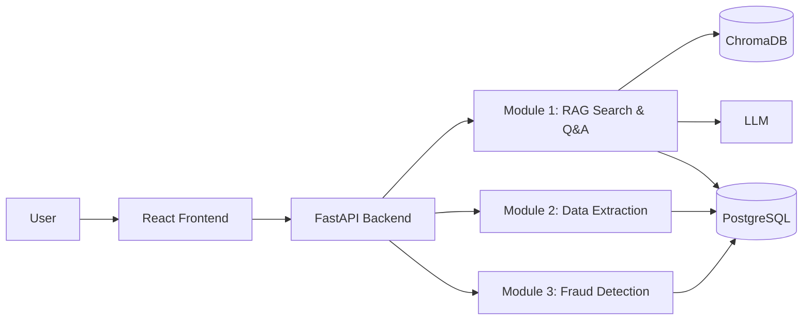

# SentinelDocs — Project Architecture Overview

*A high-level summary suitable for academic evaluation, hackathon judging, and technical interviews.*

## Problem Statement

Organizations accumulate large volumes of documents — contracts, invoices, scanned forms, emails — that are difficult to search, extract data from, and verify for authenticity. Keyword search fails when the exact wording isn't known; manual data entry from forms is slow and error-prone; and forged or tampered documents can slip into workflows undetected. SentinelDocs addresses all three problems as one integrated system rather than three separate tools.

## Architecture at a Glance

The backend is a single FastAPI service exposing three logical modules, all sharing the same ingestion pipeline and relational database, but each with its own AI processing path.

## Data Flow

1. A user uploads a document through the frontend.
2. The backend validates, stores the file, and extracts metadata.
3. If the document is a scan or image, OCR converts it to text.
4. **Module 1** chunks the text, generates embeddings, and stores them in ChromaDB for semantic search; when a user asks a question, relevant chunks are retrieved and passed to an LLM to generate a grounded, cited answer.
5. **Module 2** detects the file's structure (structured/semi-structured/unstructured) and extracts fields into the relational database with a confidence score per field.
6. **Module 3** checks the document against known hashes for duplicates and runs forensic analysis (metadata inconsistencies, tamper indicators) to flag suspicious files before they enter a workflow.

## Why AI Is Used

Rule-based keyword search and manual data entry don't generalize across document formats or phrasing. Machine learning models — embeddings for semantic similarity, language models for text generation, and vision/forensic models for tamper detection — let the system handle documents it has never seen an exact template for.

## Why RAG Is Used (Module 1)

A language model alone doesn't know an organization's private documents and can fabricate answers. RAG retrieves the actual relevant passages first, then asks the model to answer using only that retrieved context — this reduces hallucination and, critically, lets every answer be traced back to a specific document and page, which is a hard requirement for any system used in a compliance-sensitive setting.

## How OCR Fits In

Not all documents are digitally text-searchable — scanned contracts, faxed forms, and photographed IDs are images. OCR (Tesseract) converts these into text so the same downstream pipeline (chunking, embedding, extraction) works uniformly regardless of whether the original file was "born digital" or scanned.

## Why PostgreSQL + ChromaDB (Two Databases, Not One)

These solve different problems. PostgreSQL is optimized for exact, structured queries with strong consistency guarantees — "which documents does this user have permission to see." ChromaDB is optimized for approximate nearest-neighbor search over high-dimensional vectors — "which chunks of text are semantically similar to this question." Forcing both workloads into one database engine would compromise one or the other; using both lets each do what it's best at.

## How Scalability Is Achieved

- The API layer is stateless (JWTs carry identity, no server-side session), so it scales horizontally behind a load balancer.
- Object storage, relational storage, and vector storage are each independently scalable services, not tied to the API process.
- OCR and embedding generation are CPU/compute-heavy and are isolated as their own services, making it straightforward to move them to background workers or separate machines as load grows.
- Every environment (dev, staging, prod) is defined by Docker Compose, so scaling out is a matter of infrastructure configuration, not code changes.

## How Security Is Maintained

- **Authentication**: JWT-based, with short-lived tokens and role claims.
- **Authorization**: Role-based access control (RBAC) restricts which folders/record classes a user can query — Module 1's retrieval layer filters by permission before returning any chunk.
- **Input validation**: File type/size validation at upload time; all API inputs validated via Pydantic schemas.
- **Least privilege on storage**: object storage credentials are scoped per environment, never hardcoded (managed via `.env`, excluded from version control).
- **Fraud detection as a security control**: Module 3 acts as a gate before documents are trusted into downstream workflows, not just a passive report.
